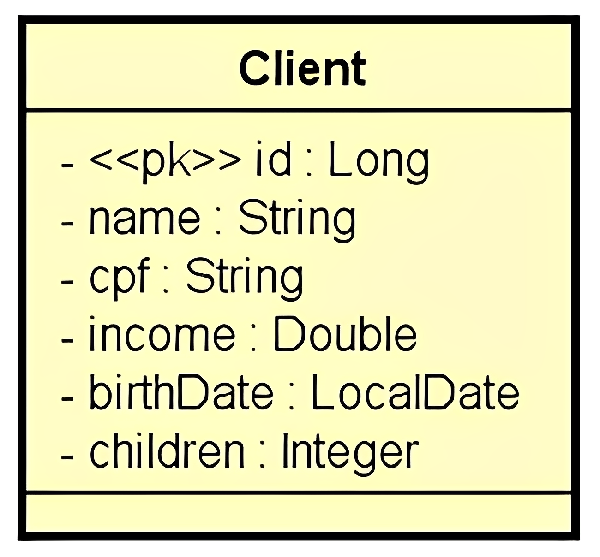
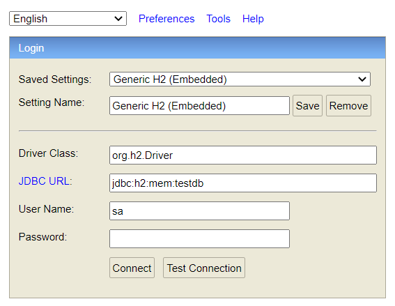

<div align="center">
  <h1><strong>CRUD de Clientes</strong></h1>
</div>

## Índice

- [Índice](#índice)
- [Sobre](#sobre)
- [Funcionalidades](#funcionalidades)
  - [Para o Usuário](#para-o-usuário)
  - [Para o Desenvolvedor](#para-o-desenvolvedor)
  - [Operações](#operações)
  - [Diagrama de Classes](#diagrama-de-classes)
- [Tecnologias Utilizadas](#tecnologias-utilizadas)
- [Instalação e Uso](#instalação-e-uso)
- [Como Contribuir](#como-contribuir)
- [Créditos](#créditos)
- [Contato](#contato)
- [Licença](#licença)
- [Status do Projeto](#status-do-projeto)

## Sobre

Este projeto consiste em um CRUD de Clientes desenvolvido em `Java` com `Spring Boot`. O modelo de domínio **Client** básico, contém as seguintes propriedades:

```java
public class Client {

    private Long id;
    private String name;
    private String cpf;
    private Double income;
    private LocalDate birthDate;
    private Integer children;

    // Constructor, Getter, Setter...
}
```

[Voltar ao Índice](#índice)

## Funcionalidades

### Para o Usuário

...

### Para o Desenvolvedor

Este sistema foi desenvolvido com a finalidade de fornecer uma gestão eficaz de **Clientes**, apresentando uma interface simples e direta para as operações de **Criação**, **Consulta**, **Atualização** e **Exclusão** (CRUD).

### Operações

- **Busca Paginada de Recursos**: Este recurso permite a consulta dos dados de clientes de forma paginada, otimizando a performance ao lidar com grandes conjuntos de dados.

- **Busca de Recurso por ID**: Permite ao usuário obter os detalhes específicos de um cliente com base em seu identificador único `id`.

- **Inserção de Novo Recurso**: Permite ao usuário adicionar um novo cliente ao sistema, fornecendo os detalhes relevantes.

- **Atualização de Recurso**: Esta operação permite a modificação dos detalhes de um cliente já existente no sistema.

- **Exclusão de Recurso**: Permite a remoção de um cliente do sistema.

Essas operações compõem a base funcional do sistema, fornecendo uma interface de gerenciamento de clientes completa e eficiente. O design intuitivo e a aderência aos padrões da indústria garantem que o sistema seja fácil de usar e entender, seja para desenvolvedores ou usuários finais.

### Diagrama de Classes

- Para entender a estrutura básica do projeto, consulte o diagrama de classes abaixo. O diagrama de classes fornece uma representação visual das classes envolvidas e suas interações, facilitando a compreensão do design do projeto.

<div align="center">
  
</div>

[Voltar ao Índice](#índice)

## Tecnologias Utilizadas

Antes de iniciar, assegure-se de ter o ambiente Java corretamente configurado em sua máquina. Abaixo você tem a relação das tecnologias que foram utilizadas no processo de desenvolvimento do projeto.

| Tecnologia                  | Versão              | Logo / Link |
| --------------------------- | ------------------- | :---------: |
| Sistema Operacional         | Windows 11          | <p align="center"><a href="https://www.microsoft.com/pt-br/windows/windows-11?r=1"></a></p> |
| Linguagem de Programação (JDK) | Java 17 LTS (Azul Zulu) | <p align="center"><a href="https://www.azul.com/downloads/?package=jdk#zulu"></a></p> |
| Framework                   | Spring Boot 3.1.0   | <p align="center"><a href="https://spring.io/projects/spring-boot"></a></p> |
| Banco de Dados              | H2 Database         | <p align="center"><a href="https://www.h2database.com/html/main.html"></a></p> |
| IDE                         | IntelliJ IDEA 2023.1.2 (Community Edition) | <p align="center"><a href="https://www.jetbrains.com/idea/download/other.html"></a></p> |
| Ferramenta de Teste de API  | Postman v10.14.9    | <p align="center"><a href="https://www.postman.com/downloads/"></a></p> |

[Voltar ao Índice](#índice)

## Instalação e Uso

Clone o repositório do Github:

```sh
git clone https://github.com/solucaoerp/AdvancedJavaTraining.git
```

Através de sua IDE, navegue até o diretório `customers`, baixe as dependências e execute o projeto:

```sh
cd AdvancedJavaTraining/customers
```

Para acessar o console **H2 Database**, digite o endereço `http://localhost:8080/h2-console` em seu navegador de internet.

- Através da imagem abaixo você encontra as credenciais de acesso. Essas informações também podem ser encontradas no perfil de `test` na pasta `resources`. 

<div align="center">
  
</div>

- Este projeto é configurado para ser executado em diferentes perfis, proporcionando flexibilidade e adaptabilidade para diferentes ambientes de desenvolvimento, testes, homologação e produção. No entanto, para fins de demonstração, foi utilizado o perfil **'test'**, especificamente configurado para utilizar o banco de dados em memória H2. Isso permite a criação de um ambiente de teste ágil, facilitando a validação das funcionalidades do aplicativo sem a necessidade de configuração adicional.

O perfil ativo é definido no arquivo `application.properties`:

```properties
spring.profiles.active=test
spring.jpa.open-in-view=false
```

As configurações específicas para o perfil **'test'** são definidas no arquivo `application-test.properties`.

Com essas configurações você poderá realizar testes rapidamente e ver as consultas SQL's geradas, facilitando a identificação de possíveis problemas de desempenho ou comportamento inesperado.

[Voltar ao Índice](#índice)

## Como Contribuir

Contribuições são sempre bem-vindas! Se você tem uma sugestão que poderia melhorar este projeto, por favor, abra uma issue ou um pull request, seguindo os passos abaixo.

1. Crie um 'Fork' do projeto
2. Crie uma 'Branch' para sua modificação (`git checkout -b feature/AmazingFeature`)
3. Faça o 'Commit' das suas mudanças (`git commit -m 'Add some AmazingFeature'`)
4. 'Push' para a 'Branch' (`git push origin feature/AmazingFeature`)
5. Abra uma 'Pull Request'

[Voltar ao Índice](#índice)

## Créditos

| Referências | Acessos |
|---|---|
| Padrão REST | [Artigo](https://www.redhat.com/pt-br/topics/api/what-is-a-rest-api) |
| API REST | [Artigo](https://www.redhat.com/pt-br/topics/api/what-is-a-rest-api) |
| Verbos (métodos) HTTP mais utilizados | [Documentação](https://developer.mozilla.org/pt-BR/docs/Web/HTTP/Methods) |
| Códigos de resposta HTTP | [Documentação](https://developer.mozilla.org/pt-BR/docs/Web/HTTP/Status) |
| Anotações JPA | [Documentação](https://jakarta.ee/specifications/persistence/3.0/jakarta-persistence-spec-3.0.html#jpa-2.1-defined-annotations) |
| Anotações Hibernate | [Documentação](https://docs.jboss.org/hibernate/stable/annotations/reference/en/html_single/#d0e225) |
| Anotações Spring MVC | [Documentação](https://docs.spring.io/spring-framework/reference/testing/annotations.html) |
| Anotações Spring Framework | [Artigo](https://springframework.guru/spring-framework-annotations/) |
| Anotações Bean Validation | [Documentação](https://jakarta.ee/specifications/bean-validation/3.0/apidocs/) |
| Como copiar dados da entity para o DTO? | [Artigo](https://www.baeldung.com/entity-to-and-from-dto-for-a-java-spring-application) |
| Bean Validation | [Documentação](https://jakarta.ee/specifications/bean-validation/3.0/), [Documentação](https://jakarta.ee/specifications/bean-validation/3.0/apidocs/)|

[Voltar ao Índice](#índice)

## Contato

Se você tiver alguma dúvida, comentário ou sugestão, fique à vontade para abrir uma `issue` aqui no GitHub ou me contate diretamente através do e-mail: solucao.erp@gmail.com

[Voltar ao Índice](#índice)

## Licença

Este projeto está licenciado sob os termos da [Licença MIT](https://opensource.org/licenses/MIT). A Licença MIT é uma licença de software livre e de código aberto que permite o uso, a cópia, a modificação e a distribuição do código-fonte. Esta licença é notória por sua simplicidade e flexibilidade, incentivando a colaboração e a inovação no software de código aberto.

[Voltar ao Índice](#índice)

## Status do Projeto

Este README será atualizado conforme o projeto evolui. Fique ligado para novas funcionalidades e melhorias!

[Voltar ao Índice](#índice)