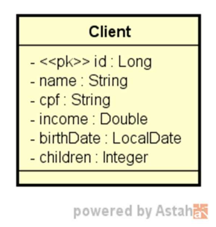

<div align="center">
  <h1>CRUD de Clientes</h1>
  
  
  
  
  
  
</div>

## Índice

- [Índice](#índice)
- [Sobre o Projeto](#sobre-o-projeto)
  - [Principais Funcionalidades](#principais-funcionalidades)
- [Pré-requisitos](#pré-requisitos)
- [Diagrama de Classes](#diagrama-de-classes)
- [Ambientes de Execução](#ambientes-de-execução)
- [Arquitetura e Camadas](#arquitetura-e-camadas)
- [Arquitetura RESTful API](#arquitetura-restful-api)
- [Métodos de CRUD](#métodos-de-crud)
- [Anotações Importantes](#anotações-importantes)
- [Tratamento de Exceções](#tratamento-de-exceções)
- [Validações](#validações)
- [Referências](#referências)
- [Instalação](#instalação)
- [Acessando H2 Database](#acessando-h2-database)
- [Contribuição](#contribuição)
- [Contato](#contato)
- [Licença](#licença)

## Sobre o Projeto

Este projeto consiste em um CRUD de Clientes desenvolvido em `Java` com `Spring Boot`. O modelo de domínio **Client** básico, contém as seguintes propriedades:

```java
public class Client {

    private Long id;
    private String name;
    private String cpf;
    private Double income;
    private LocalDate birthDate;
    private Integer children;

    // ...
}
```

### Principais Funcionalidades

Este sistema foi desenvolvido com a finalidade de fornecer uma gestão eficaz de **clientes**, apresentando uma interface simples e direta para as operações de **Criação**, **Consulta**, **Atualização** e **Exclusão** (CRUD).

Abaixo estão as principais operações disponíveis no sistema:

- **Busca Paginada de Recursos**: Este recurso permite a consulta dos dados de clientes de forma paginada, otimizando a performance ao lidar com grandes conjuntos de dados.

- **Busca de Recurso por ID**: Permite ao usuário obter os detalhes específicos de um cliente com base em seu identificador único `id`.

- **Inserção de Novo Recurso**: Permite ao usuário adicionar um novo cliente ao sistema, fornecendo os detalhes relevantes.

- **Atualização de Recurso**: Esta operação permite a modificação dos detalhes de um cliente já existente no sistema.

- **Exclusão de Recurso**: Permite a remoção de um cliente do sistema.

Essas operações compõem a base funcional do sistema, fornecendo uma interface de gerenciamento de clientes completa e eficiente. O design intuitivo e a aderência aos padrões da indústria garantem que o sistema seja fácil de usar e entender, seja para desenvolvedores ou usuários finais.

## Pré-requisitos

Antes de iniciar, assegure-se de ter o ambiente Java corretamente configurado em sua máquina. Abaixo você tem a relação das tecnologias que foram utilizadas no processo de desenvolvimento do projeto.

| Tecnologia                  | Versão              |
| --------------------------- | ------------------- |
| Sistema Operacional         | Windows 11          |
| Linguagem de Programação    | Java 17 LTS (Azul Zulu) |
| Framework                   | Spring Boot 3.1.0 (configurado via dependência pom.xml)  |
| Banco de Dados              | H2 Database (configurado via dependência pom.xml)  |
| IDE                         | IntelliJ IDEA 2023.1.2 (Community Edition) |
| Ferramenta de Teste de API  | Postman v10.14.9    |

Para instalar e executar este projeto, você precisa ter os pré-requisitos acima instalados em seu ambiente de desenvolvimento.

## Diagrama de Classes

Para entender a estrutura básica do projeto, consulte o diagrama de classes abaixo. O diagrama de classes fornece uma representação visual das classes envolvidas e suas interações, facilitando a compreensão do design do projeto.

<div align="center">
  
</div>

## Ambientes de Execução

Este projeto é configurado para ser executado em diferentes perfis, proporcionando flexibilidade e adaptabilidade para diferentes ambientes de desenvolvimento, testes, homologação e produção. No entanto, para fins de demonstração, foi utilizado o perfil **'test'**, especificamente configurado para utilizar o banco de dados em memória H2. Isso permite a criação de um ambiente de teste ágil, facilitando a validação das funcionalidades do aplicativo sem a necessidade de configuração adicional.

O perfil ativo é definido no arquivo `application.properties`:

```properties
spring.profiles.active=test
spring.jpa.open-in-view=false
```

As configurações específicas para o perfil **'test'** são definidas no arquivo `application-test.properties`:

```properties
# Configuração de Conexão com Banco de Dados H2
spring.datasource.driverClassName=org.h2.Driver
spring.datasource.url=jdbc:h2:mem:testdb
spring.datasource.username=sa
spring.datasource.password=

# Configuração do Console H2
spring.h2.console.enabled=true
spring.h2.console.path=/h2-console

# Configurações JPA e SQL
spring.jpa.database-platform=org.hibernate.dialect.H2Dialect
spring.jpa.defer-datasource-initialization=true
spring.jpa.show-sql=true
spring.jpa.properties.hibernate.format_sql=true
```

Com essas configurações, você pode realizar testes rapidamente e ver as consultas SQL geradas, facilitando a identificação de possíveis problemas de desempenho ou comportamento inesperado. Para mais detalhes, veja a seção sobre [Acessando H2 Database](#acessando-h2-database).

## Arquitetura e Camadas

Este projeto foi desenvolvido seguindo a arquitetura em camadas e a organização padrão de pacotes sugerida pelo **Spring Boot**. Cada pacote tem uma responsabilidade distinta, permitindo uma separação clara das responsabilidades e facilitando a manutenção e expansão do código. A seguir, um breve resumo das responsabilidades de cada camada:

- **entities**: Esta camada contém as classes de entidade que mapeiam diretamente para as tabelas do banco de dados. Essas classes são usadas pelo **Hibernate**, que é o provedor de **JPA** do **Spring Boot** para criar, recuperar, atualizar e excluir registros no banco de dados. Elas representam o estado e o comportamento das "**coisas**" do domínio do problema.

- **dtos**: As classes **DTO** `Data Transfer Object` residem nesta camada. Elas são responsáveis por carregar dados entre processos ou entre o cliente e o servidor em uma arquitetura distribuída. Na aplicação elas são usadas para estruturar os dados que serão exibidos para o usuário, bem como para receber dados enviados pelo usuário.

- **services**: Esta camada inclui as classes de serviço que encapsulam a lógica de negócios do aplicativo. Elas funcionam como uma ponte entre os controladores e os repositórios, realizando operações e transformações complexas nos dados.

- **controllers**: Aqui estão as classes de controladores, que funcionam como o ponto de entrada para todas as solicitações **HTTP**. Eles interagem com a camada de serviço para processar as solicitações e retornar as respostas adequadas ao *solicitante*. Em outras palavras, eles manipulam a comunicação entre o cliente e o servidor.

- **repositories**: Esta camada inclui as `interfaces` de repositório, que fornecem uma abstração da persistência de dados. Eles são usados para operações de banco de dados, como consultas e atualizações. Graças ao `Spring Data JPA`, apenas a declaração da interface é necessária - a implementação é fornecida automaticamente pelo Spring.

## Arquitetura RESTful API

Neste projeto, empregamos uma arquitetura de `API RESTful`. Esta abordagem moderna para o desenvolvimento de APIs é caracterizada pela exploração dos protocolos HTTP padrão e a utilização de princípios de arquitetura bem estabelecidos para possibilitar a interação entre cliente e servidor.

As `API RESTful` operam através de métodos `HTTP` claramente definidos, incluindo `GET`, `POST`, `PUT` e `DELETE`, cada um correspondendo a uma operação específica de CRUD. Este projeto adere rigorosamente a esses padrões, garantindo que a API seja intuitiva e fácil de usar para os desenvolvedores clientes.

As respostas da API são formatadas em `JSON` (**JavaScript Object Notation**), um formato leve para intercâmbio de dados que é fácil de ler e escrever. Este padrão facilita a interoperabilidade e torna a API compatível com uma ampla gama de clientes, desde navegadores web a aplicações móveis.

Além disso, a aderência aos princípios REST também significa que a API é `stateless`, garantindo escalabilidade à medida que as demandas de tráfego aumentam. Cada requisição do cliente contém todas as informações necessárias para o servidor entender e responder à solicitação, sem a necessidade de manter um estado de sessão entre requisições.

- **`Stateless`** é um termo usado em informática para descrever um protocolo, um servidor ou uma aplicação que não armazena informações sobre o estado da sessão entre as requisições. Em outras palavras, cada requisição é processada independentemente das requisições anteriores ou futuras.

- No contexto de uma `API RESTful`, ser "**stateless**" significa que o servidor não mantém qualquer informação sobre o estado do cliente entre as requisições HTTP. Cada requisição individual contém todas as informações necessárias para que o servidor entenda e processe a solicitação.

- Isso contrasta com sistemas "**stateful**", onde o servidor mantém informações sobre o estado da sessão do cliente, permitindo que o servidor se lembre do estado anterior do cliente para processar a próxima requisição.

- A principal vantagem de ser "**stateless**" é a escalabilidade. Como o servidor não precisa manter o estado da sessão, é mais fácil para ele lidar com grandes volumes de requisições de muitos clientes diferentes simultaneamente. Além disso, torna a aplicação mais previsível e fácil de testar, pois cada requisição é processada de forma isolada.

Esses princípios orientam a construção da API, assegurando que ela seja robusta, escalável e fácil de integrar em qualquer aplicação cliente.

Entendi, você quer apenas uma tabela contendo o nome da tecnologia e o link para a documentação. Aqui está:

| Tecnologia | Link da Documentação |
| --- | --- |
| API REST | [https://www.redhat.com/pt-br/topics/api/what-is-a-rest-api](https://www.redhat.com/pt-br/topics/api/what-is-a-rest-api) |

## Métodos de CRUD

No contexto desta aplicação, foram implementadas operações fundamentais de persistência de dados, comumente conhecidas como operações CRUD (Create, Read, Update, Delete). Essas operações formam a espinha dorsal da interação do usuário com quaisquer dados persistentes no sistema e são essenciais para a maioria das aplicações de gerenciamento de dados.

As operações são representadas da seguinte forma no protocolo `HTTP`:

- **GET**: Essa requisição é utilizada para a leitura de dados. Temos duas operações principais implementadas: a `busca paginada de recursos`, que permite ao usuário navegar pelos dados de forma eficiente e escalonável, e a `busca de recurso por ID`, que recupera os detalhes de um recurso específico.

- **POST**: Esta requisição é utilizada para a criação de um novo recurso. O corpo da requisição HTTP contém os detalhes do recurso a ser criado. Após a criação bem-sucedida, a nova entidade é retornada na resposta.

- **PUT**: Esta requisição é usada para a atualização de um recurso existente. Similar ao método POST, o corpo da requisição contém os novos detalhes do recurso. A aplicação então localiza o recurso existente e atualiza seus detalhes. 
  - **OBSERVAÇÃO!** É importante destacar que o método PUT é **idempotente**, o que significa que independentemente do número de vezes que é feita uma requisição, o resultado será sempre o mesmo, desde que a mesma entrada seja fornecida. Isso garante a consistência das operações de atualização, pois uma atualização repetida terá o mesmo efeito que uma única atualização.

- **DELETE**: Esta requisição é usada para a remoção de um recurso. A aplicação localiza o recurso a ser removido e o exclui do banco de dados.

Cada uma dessas operações é adequadamente encapsulada em suas respectivas camadas de aplicação. Os controladores recebem as requisições HTTP e delegam para os serviços a execução das operações. Os serviços, por sua vez, interagem com os repositórios para a persistência dos dados.

Essa estruturação respeita os princípios de uma arquitetura limpa, com uma separação clara das responsabilidades, promovendo a manutenibilidade e a escalabilidade do código.

## Anotações Importantes

As seguintes anotações são frequentemente usadas neste projeto:

**Anotações JPA/Hibernate**
| Anotação | Descrição |
|---|---|
| `@Entity` | Indica que a classe é uma entidade JPA e será mapeada para uma tabela no banco de dados. |
| `@Table` | Usada para especificar detalhes sobre a tabela à qual a entidade será mapeada. |
| `@Id` | Indica que o campo é a chave primária da entidade. |
| `@GeneratedValue` | Usada em conjunto com `@Id`, especifica que o valor do campo será gerado automaticamente. |
| Anotações JPA | [Documentação](https://jakarta.ee/specifications/persistence/3.0/jakarta-persistence-spec-3.0.html#jpa-2.1-defined-annotations) |
| Anotações Hibernate | [Documentação](https://docs.jboss.org/hibernate/stable/annotations/reference/en/html_single/#d0e225) |

**Anotações Spring MVC**
| Anotação | Descrição |
|---|---|
| `@RestController` | Indica que a classe é um controlador e que seus métodos retornarão a resposta diretamente. |
| `@RequestMapping` | Define a URL base para todos os endpoints do controlador. |
| `@GetMapping` | Indica que o método manipulará requisições HTTP GET para um caminho específico. |
| `@PostMapping` | Indica que o método manipulará requisições HTTP POST para um caminho específico. |
| `@PutMapping` | Indica que o método manipulará requisições HTTP PUT para um caminho específico. |
| `@DeleteMapping` | Indica que o método manipulará requisições HTTP DELETE para um caminho específico. |
| `@PathVariable` | Usado para mapear variáveis de caminho da URL para parâmetros do método. |
| `@RequestBody` | Indica que o parâmetro do método deve ser vinculado ao corpo da requisição HTTP. |
| Anotações Spring MVC | [Documentação](https://docs.spring.io/spring-framework/reference/testing/annotations.html) |

**Anotações Spring Framework**
| Anotação | Descrição |
|---|---|
| `@Transactional` | Indica que o método deve ser executado dentro de uma transação. |
| `@Service` | Indica que a classe é um serviço dentro da arquitetura da aplicação. |
| `@ControllerAdvice` | Usada para tratar exceções em todos os controladores de uma forma centralizada. |
| Anotações Spring Framework | [Artigo](https://springframework.guru/spring-framework-annotations/) |

**Anotações Bean Validation**
| Anotação | Descrição |
|---|---|
| `@PastOrPresent` | Usada para validar se a data está no passado ou é a data atual. |
| `@NotBlank` | Verifica se a string não é nula e tem pelo menos um caractere visível. |
| `@CPF` | Verifica se a string é um CPF válido. |
| `@NotNull` | Verifica se o valor do campo não é nulo. |
| `@Min` | Verifica se o número é igual ou maior que um valor mínimo. |
| `@DecimalMin` | Verifica se o número decimal é maior que ou igual a um valor mínimo especificado. |
| Anotações Bean Validation | [Documentação](https://jakarta.ee/specifications/bean-validation/3.0/apidocs/) |


## Tratamento de Exceções

A robustez e a resiliência de uma aplicação moderna são alicerçadas no tratamento eficaz de exceções. Nesse contexto, este projeto emprega a anotação **@ControllerAdvice** para lidar com exceções de maneira global e consistente.

O uso de **@ControllerAdvice** permite um tratamento centralizado de múltiplas classes de exceções em toda a aplicação, otimizando a lógica de tratamento de erros e proporcionando uma experiência de usuário mais consistente e informativa.

As classes de exceções tratadas podem ser categorizadas em dois grupos principais:

- **Exceções do Lado Cliente**: Estas são geralmente o resultado de solicitações malformadas ou dados de usuário inválidos. São situações em que o cliente deve corrigir a solicitação antes de reenviá-la. Essas exceções são mapeadas para respostas de erro no intervalo de 4xx, indicando ao cliente que a solicitação não pode ser atendida devido a algum problema com os dados fornecidos.

- **Exceções do Lado Servidor**: Estas ocorrem quando há algum problema com o servidor ou com a lógica de negócio durante o processamento de uma requisição válida. Essas exceções são mapeadas para respostas de erro no intervalo de 5xx, indicando ao cliente que houve uma falha no servidor durante a manipulação da requisição.

Em ambos os casos, as mensagens de erro fornecem detalhes suficientes para diagnosticar a causa do problema, preservando ao mesmo tempo a segurança e a integridade da aplicação.

## Validações

As validações devem ser aplicadas nos objetos de transferência de dados (**DTOs**), que são os objetos diretamente preenchidos com os dados da requisição.

As validações de entrada de dados são melhor colocadas nos **DTOs** porque é nesse ponto que os dados chegam do cliente. Por colocar as validações aqui, você pode pegar e manipular problemas de entrada de dados o mais cedo possível.

É importante ressaltar que as validações nos **DTOs** são uma linha de defesa inicial contra dados inválidos. Elas não substituem a necessidade de também ter uma validação robusta na camada de serviço ou regra de negócio, especialmente para casos que envolvem verificações mais complexas que requerem interação com a base de dados ou outros componentes do sistema.

Exemplo do **DTO** com validações:

```java
public class ClientDTO {

    @NotBlank(message = "O nome não pode ser vazio.")
    private String name;

    @CPF(message = "O CPF informado não é válido.")
    private String cpf;

    @NotNull
    @DecimalMin("0.0")
    private Double income;

    @NotNull
    @PastOrPresent(message = "A data de nascimento não pode ser uma data futura.")
    private LocalDate birthDate;

    @NotNull
    @Min(0)
    private Integer children;

    // Getters and setters
    // ...
}
```

Neste exemplo, cada campo do DTO `ClientDTO` é anotado com validações. Quando uma solicitação chega, os dados da solicitação são validados contra essas anotações e, se qualquer campo for inválido, uma exceção é lançada.

Foi usado a especificação `Bean Validation` para validar os dados do lado do servidor.

## Referências

| Tópico | Link da Documentação |
| --- | --- |
| Padrão REST | [Artigo](https://www.redhat.com/pt-br/topics/api/what-is-a-rest-api) |
| Verbos (métodos) HTTP mais utilizados | [Documentação](https://developer.mozilla.org/pt-BR/docs/Web/HTTP/Methods) |
| Códigos de resposta HTTP | [Documentação](https://developer.mozilla.org/pt-BR/docs/Web/HTTP/Status) |
| Como copiar dados da entity para o DTO? | [Artigo](https://www.baeldung.com/entity-to-and-from-dto-for-a-java-spring-application) |
| Bean Validation | [Documentação](https://jakarta.ee/specifications/bean-validation/3.0/), [Documentação](https://jakarta.ee/specifications/bean-validation/3.0/apidocs/)|


## Instalação

Clone o repositório do Github:

```sh
git clone https://github.com/solucaoerp/AdvancedJavaTraining.git
```

Através de sua IDE, navegue até o diretório do projeto `customers`, baixe as dependências e execute o projeto:

```sh
cd AdvancedJavaTraining/customers
```

## Acessando H2 Database

Para acessar o console H2, digite o endereço `http://localhost:8080/h2-console` em seu navegador de internet.

Na imagem abaixo você encontra as credenciais de acesso. Essas informações também podem ser encontradas no perfil de `test` na pasta `resources`. 

<div align="center">
  
</div>

## Contribuição

Caso queira contribuir para este projeto, siga os seguintes passos:

1. Crie um 'Fork' do projeto
2. Crie uma 'Branch' para sua modificação (`git checkout -b feature/AmazingFeature`)
3. Faça o 'Commit' das suas mudanças (`git commit -m 'Add some AmazingFeature'`)
4. 'Push' para a 'Branch' (`git push origin feature/AmazingFeature`)
5. Abra uma 'Pull Request'

## Contato

Se você tiver alguma dúvida relacionada ao projeto, entre em contato através do e-mail: solucao.erp@gmail.com.

## Licença

Este projeto está licenciado sob os termos da [Licença MIT](https://opensource.org/licenses/MIT). A Licença MIT é uma licença de software livre e de código aberto que permite o uso, a cópia, a modificação e a distribuição do código-fonte. Esta licença é notória por sua simplicidade e flexibilidade, incentivando a colaboração e a inovação no software de código aberto.

---

Este README será atualizado conforme o projeto evolui. Fique ligado para novas funcionalidades e melhorias!