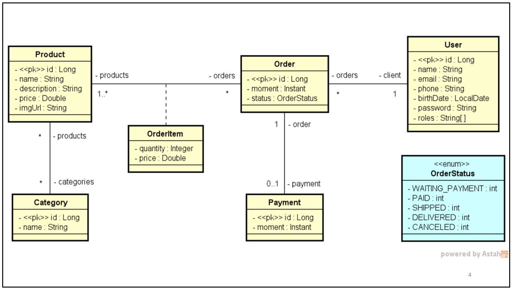

<div align="center">
  <h1>DSCommerce</h1>
  
  
  
</div>

## Índice

- [Índice](#índice)
- [Sobre o Projeto](#sobre-o-projeto)
  - [Recursos](#recursos)
- [Pré-requisitos](#pré-requisitos)
- [Diagrama de Classes](#diagrama-de-classes)
- [Instalação](#instalação)
- [Acessando H2 Database](#acessando-h2-database)
- [Contribuição](#contribuição)
- [Contato](#contato)
- [Licença](#licença)

## Sobre o Projeto

Este é um projeto `Java` com `Spring Boot` que oferece uma maneira de gerenciar as informações de um sistema de comércio eletrônico.  Inicialmente o projeto abrange o mapeamento das entidades de domínio conforme diagrama, e o `Seeding` que refere-se ao processo de preenchimento do Banco de Dados com os dados iniciais, ou dados padrões.

### Recursos

- Ele é capaz de manter um catálogo de produtos categorizados para que os usuários possam navegar, selecionar produtos para visualizar detalhes e adicioná-los a um carrinho de compras.
- Os pedidos realizados pelos usuários serão salvos no sistema com o status "AGUARDANDO PAGAMENTO". Os pedidos podem ter seus status atualizados para: PAGO, ENVIADO, ENTREGUE ou CANCELADO.
- Há duas categorias de usuários: CLIENTES e ADMINISTRADORES. Enquanto os Clientes podem atualizar seu cadastro, fazer pedidos e visualizar seus pedidos, os Administradores têm acesso à área administrativa, onde podem acessar todos os cadastros de usuários, produtos e categorias.

## Pré-requisitos

Antes de iniciar, assegure-se de ter o ambiente Java corretamente configurado em sua máquina. Abaixo a relação das tecnologias utilizadas no desenvolvimento do projeto.

- [Sistema Operacional Windows 11](https://www.microsoft.com/pt-br/windows/windows-11?r=1)
- [JDK com Java 17 LTS](https://www.azul.com/downloads/?version=java-17-lts&os=windows&architecture=x86-64-bit&package=jdk#zulu)
- [Spring Boot 3.1.0](https://start.spring.io/)
- [Banco de dados H2](https://www.h2database.com/html/main.html): configurado via dependência `pom.xml`
- [IntelliJ IDEA 2023.1.2 (Community Edition)](https://www.jetbrains.com/idea/download/other.html)

## Diagrama de Classes

Para entender a estrutura básica do projeto, consulte o diagrama de classes abaixo. O diagrama fornece uma visão geral das entidades do projeto e suas relações. É uma visão geral de como as Classes (Entidades/Domínios) estão organizadas e interagem entre si. Isso facilita a compreensão da estrutura do código.

<div align="center">
  
</div>

## Instalação

Clone o repositório do Github:

```sh
git clone https://github.com/solucaoerp/AdvancedJavaTraining.git
```

Através de sua IDE, navegue até o diretório do projeto `dscommerce`, baixe as dependências e execute o projeto:

```sh
cd AdvancedJavaTraining/dscommerce
```

## Acessando H2 Database

Para acessar o console H2, digite o endereço `http://localhost:8080/h2-console` em seu navegador de internet.

Na imagem abaixo você encontra as credenciais de acesso. Essas informações também podem ser encontradas no perfil de `test` na pasta `resources`. 

<div align="center">
  
</div>

## Contribuição

Caso queira contribuir para este projeto, siga os seguintes passos:

1. Crie um 'Fork' do projeto
2. Crie uma 'Branch' para sua modificação (`git checkout -b feature/AmazingFeature`)
3. Faça o 'Commit' das suas mudanças (`git commit -m 'Add some AmazingFeature'`)
4. 'Push' para a 'Branch' (`git push origin feature/AmazingFeature`)
5. Abra uma 'Pull Request'

## Contato

Se você tiver alguma dúvida relacionada ao projeto, entre em contato através do e-mail: solucao.erp@gmail.com.

## Licença

Este projeto está licenciado sob os termos da [Licença MIT](https://opensource.org/licenses/MIT). A Licença MIT é uma licença de software livre e de código aberto que permite o uso, a cópia, a modificação e a distribuição do código-fonte. Esta licença é notória por sua simplicidade e flexibilidade, incentivando a colaboração e a inovação no software de código aberto.

---

Este README será atualizado conforme o projeto evolui. Fique ligado para novas funcionalidades e melhorias!