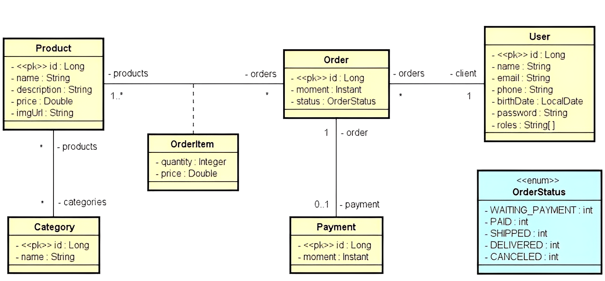

<div align="center">
  <h1><strong>DSCommerce: Sistema de Comércio Eletrônico</strong></h1>
</div>

## Índice

- [Índice](#índice)
- [Sobre](#sobre)
- [Funcionalidades](#funcionalidades)
  - [Para o Usuário](#para-o-usuário)
  - [Para o Desenvolvedor](#para-o-desenvolvedor)
- [Tecnologias Utilizadas](#tecnologias-utilizadas)
- [Instalação e Uso](#instalação-e-uso)
- [Como Contribuir](#como-contribuir)
- [Créditos](#créditos)
- [Contato](#contato)
- [Licença](#licença)
- [Status do Projeto](#status-do-projeto)

## Sobre

Este é um projeto `Java` com `Spring Boot` que oferece uma maneira de gerenciar as informações de um sistema de comércio eletrônico.  Inicialmente o projeto abrange o mapeamento das entidades de domínio conforme diagrama, e o `Seeding` que refere-se ao processo de preenchimento do Banco de Dados com os dados iniciais, ou dados padrões.

[Voltar ao Índice](#índice)

## Funcionalidades

### Para o Usuário

...

### Para o Desenvolvedor

- Ele é capaz de manter um catálogo de produtos categorizados para que os usuários possam navegar, selecionar produtos para visualizar detalhes e adicioná-los a um carrinho de compras.
- Os pedidos realizados pelos usuários serão salvos no sistema com o status "AGUARDANDO PAGAMENTO". Os pedidos podem ter seus status atualizados para: PAGO, ENVIADO, ENTREGUE ou CANCELADO.
- Há duas categorias de usuários: CLIENTES e ADMINISTRADORES. Enquanto os Clientes podem atualizar seu cadastro, fazer pedidos e visualizar seus pedidos, os Administradores têm acesso à área administrativa, onde podem acessar todos os cadastros de usuários, produtos e categorias.

- **Diagrama de Classes**

Para entender a estrutura básica do projeto, consulte o diagrama de classes abaixo. O diagrama de classes fornece uma representação visual das classes envolvidas e suas interações, facilitando a compreensão do design do projeto.

<div align="center">
  
</div>

[Voltar ao Índice](#índice)

## Tecnologias Utilizadas

Antes de iniciar, assegure-se de ter o ambiente Java corretamente configurado em sua máquina. Abaixo você tem a relação das tecnologias que foram utilizadas no processo de desenvolvimento do projeto.

| Tecnologia                  | Versão              | Logo / Link |
| --------------------------- | ------------------- | :---------: |
| Sistema Operacional         | Windows 11          | <p align="center"><a href="https://www.microsoft.com/pt-br/windows/windows-11?r=1"></a></p> |
| Linguagem de Programação (JDK) | Java 17 LTS (Azul Zulu) | <p align="center"><a href="https://www.azul.com/downloads/?package=jdk#zulu"></a></p> |
| Framework                   | Spring Boot 3.1.0   | <p align="center"><a href="https://spring.io/projects/spring-boot"></a></p> |
| Banco de Dados              | H2 Database         | <p align="center"><a href="https://www.h2database.com/html/main.html"></a></p> |
| IDE                         | IntelliJ IDEA 2023.1.2 (Community Edition) | <p align="center"><a href="https://www.jetbrains.com/idea/download/other.html"></a></p> |
| Ferramenta de Teste de API  | Postman v10.14.9    | <p align="center"><a href="https://www.postman.com/downloads/"></a></p> |

[Voltar ao Índice](#índice)

## Instalação e Uso

Clone o repositório do Github:

```sh
git clone git@github.com:solucaoerp/AdvancedJavaTraining.git
```

Através de sua IDE, navegue até o diretório `dscommerce`, baixe as dependências e execute o projeto:

```sh
cd AdvancedJavaTraining/dscommerce
```

Para acessar o console **H2 Database**, digite o endereço `http://localhost:8080/h2-console` em seu navegador de internet.

- Através da imagem abaixo você encontra as credenciais de acesso. Essas informações também podem ser encontradas no perfil de `test` na pasta `resources`. 

<div align="center">
  
</div>

- Este projeto é configurado para ser executado em diferentes perfis, proporcionando flexibilidade e adaptabilidade para diferentes ambientes de desenvolvimento, testes, homologação e produção. No entanto, para fins de demonstração, foi utilizado o perfil **'test'**, especificamente configurado para utilizar o banco de dados em memória H2. Isso permite a criação de um ambiente de teste ágil, facilitando a validação das funcionalidades do aplicativo sem a necessidade de configuração adicional.

O perfil ativo é definido no arquivo `application.properties`:

```properties
spring.profiles.active=test
spring.jpa.open-in-view=false
```

As configurações específicas para o perfil **'test'** são definidas no arquivo `application-test.properties`.

Com essas configurações você poderá realizar testes rapidamente e ver as consultas SQL's geradas, facilitando a identificação de possíveis problemas de desempenho ou comportamento inesperado.

[Voltar ao Índice](#índice)

## Como Contribuir

Contribuições são sempre bem-vindas! Se você tem uma sugestão que poderia melhorar este projeto, por favor, abra uma issue ou um pull request, seguindo os passos abaixo.

1. Crie um 'Fork' do projeto
2. Crie uma 'Branch' para sua modificação (`git checkout -b feature/AmazingFeature`)
3. Faça o 'Commit' das suas mudanças (`git commit -m 'Add some AmazingFeature'`)
4. 'Push' para a 'Branch' (`git push origin feature/AmazingFeature`)
5. Abra uma 'Pull Request'

[Voltar ao Índice](#índice)

## Créditos

| Referências | Acessos |
|---|---|
| Revisão Álgebra Relacional e SQL | [Vídeo](https://youtu.be/GHpE5xOxXXI) |
| Super revisão de OO e SQL com Java e JDBC | [Vídeo](https://youtu.be/xC_yKw3MYX4) |
| Nivelamento ORM - JPA e Hibernate | [Vídeo](https://youtu.be/CAP1IPgeJkw) |
| Recomendação para campo tipo Instant | [Vídeo](https://youtu.be/WnJUI-jMQGE) |

[Voltar ao Índice](#índice)

## Contato

Se você tiver alguma dúvida, comentário ou sugestão, fique à vontade para abrir uma `issue` aqui no GitHub ou me contate diretamente através do e-mail: solucao.erp@gmail.com

[Voltar ao Índice](#índice)

## Licença

Este projeto está licenciado sob os termos da [Licença MIT](https://opensource.org/licenses/MIT). A Licença MIT é uma licença de software livre e de código aberto que permite o uso, a cópia, a modificação e a distribuição do código-fonte. Esta licença é notória por sua simplicidade e flexibilidade, incentivando a colaboração e a inovação no software de código aberto.

[Voltar ao Índice](#índice)

## Status do Projeto

Este README será atualizado conforme o projeto evolui. Fique ligado para novas funcionalidades e melhorias!

[Voltar ao Índice](#índice)